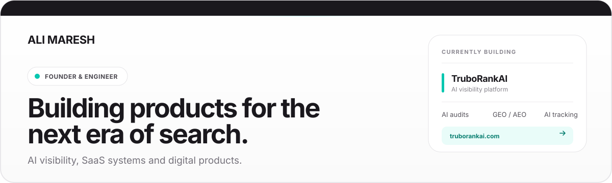
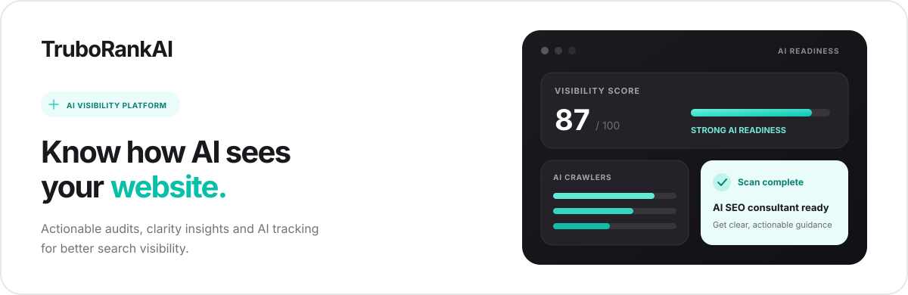
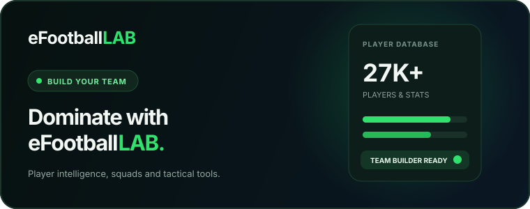
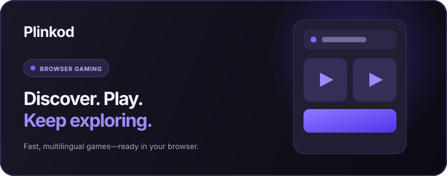

  

  
  
  
  

## About me

I am an **AI engineer, SaaS founder, web developer, game developer, and content creator** focused on turning technical ideas into useful products.

- Founder of **TruboRankAI**, **eFootballLab**, and **Plinkod**
- Building AI visibility, GEO, AEO, analytics, and automation tools
- More than 5 years of experience building games with Unity
- Interested in LLM agents, RAG systems, AI search, and practical machine learning
- Creating technical and product-focused content for developers and builders

## Featured product

**TruboRankAI** helps websites improve their visibility across AI search engines and traditional search.

`AI Site Audits` `AI Clarity Audits` `GEO` `AEO` `AIO` `AI Crawler Tracking` `Google Search Console` `RAG Assistant` `Shopify Integration`

  

## Products I have built

<table>
  <tr>
    <td width="50%" valign="top">
      
       
      <b>eFootballLab</b>
       
      AI-powered squad building, tactical analysis, player tools, and eFootball resources.
        
      <a href="https://efootballlab.com">Visit project</a>
    </td>
    <td width="50%" valign="top">
      
       
      <b>Plinkod</b>
       
      A multilingual browser gaming platform designed for fast access, discovery, and play.
        
      <a href="https://plinkod.com">Visit project</a>
    </td>
  </tr>
</table>

## Tech stack

  

**AI and machine learning**

`Python` `PyTorch` `Scikit-learn` `RAG` `LLM Agents` `Embeddings` `Computer Vision`

**Web and SaaS**

`PHP` `JavaScript` `MySQL` `MongoDB` `HTML` `CSS` `REST APIs` `Shopify`

**Game development**

`Unity` `C#` `DOTween` `Gameplay Systems` `UI Development`

**Data and infrastructure**

`Docker` `Git` `GitHub Actions` `Cloudflare`

## Currently building

- More accurate AI website audits and recommendations for TruboRankAI
- AI-powered player and tactical tools for eFootballLab
- Practical LLM agents and multi-agent systems
- Developer tools that simplify indexing, analytics, and automation

## Content

I share content about artificial intelligence, web development, game development, digital products, and the process of building real projects.

  
  

## Contact

For product discussions, collaborations, or project inquiries:

  

  Building products, learning in public, and improving one commit at a time.

